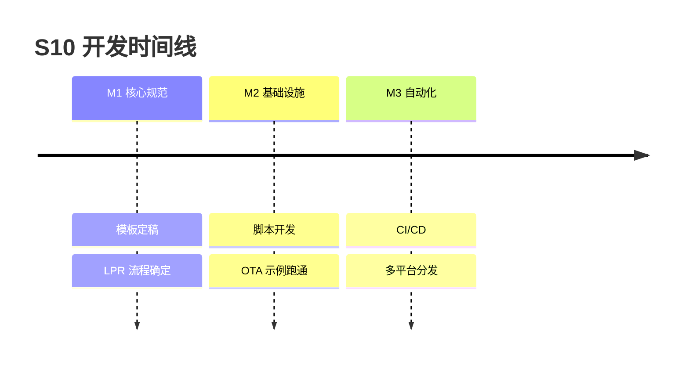

═══════════════════════════════════════════════════════════════════════════════
                    /em new EM-SKILL 学习模式升级 v4.1
═══════════════════════════════════════════════════════════════════════════════

【触发】
User: /em new EM-SKILL 学习模式升级：新增 LPR 闭环、主题 README 卡片、
      多格式输出、知识图谱、调研资料轻量管理

【AI 档位推荐】

🆕 新功能: EM-SKILL 学习模式升级 v4.1
   分配步骤: S10
   推荐档位: 重   理由: 系统级工作流重构，涉及 LPR 闭环设计、多模块联动、
                      知识图谱架构，且为嵌入式工程师核心工具，需严谨对齐
   其他档位: /em new ... --light | --std | --deep
   ━━━━━━━━━━━━━━━━━━━━━━━━━━━━
   输入 `继续` 采用推荐档位，或输入 `轻/中/重` 改档。

User: 继续

【确认输出】

🆕 S10: EM-SKILL 学习模式升级 v4.1
档位:   重
讨论ID: 20260713-em-skill-learning-v4
━━━━━━━━━━━━━━━━━━━━━━━━━━━━

═══════════════════════════════════════════════════════════════════════════════
阶段 1/5: 功能拆分 (split.md)
═══════════════════════════════════════════════════════════════════════════════

【AI 提示】
将"学习模式升级"拆分为可独立验证的子功能：

1. 【核心载体】主题 README 卡片规范
   - 5 段式结构（钩子→总结→架构→代码→踩坑）
   - 模块化模板（核心必选 + 主题自选）
   - 多模态元素（Mermaid + ASCII + Callout + Badge）

2. 【工作流】LPR 闭环 (Learn-Practice-Retro)
   - L1 Learn: 调研 → knowledge.md
   - L2 Pack: 沉淀 → knowledge-pack.md + 概念图
   - L3 Practice: 编码 → 复用 /em new 三档
   - L4 Verify: 实战 → 复用 /em verify + serial-mcp
   - L5 Surface: 暴露 → README 主题卡片

3. 【索引层】知识图谱 + _index.json
   - 主题元数据（复杂度、状态、标签）
   - 关联图谱（前置/进阶/并行）
   - 复用指数（被引用次数、代码复用）

4. 【调研管理】research/ 轻量层
   - bib.json 结构化引用（URL + 关键收获 + 引用位置）
   - 外部存储策略（视频/PDF 不存仓库）
   - 人类可读索引表

5. 【构建层】多格式输出脚本
   - build-html.py: Markdown → HTML（暗色主题 + Mermaid）
   - generate-script.py: README → 视频口播稿
   - generate-poster.py: _index.json → SVG 海报
   - package-skill.py: 打包 .skill 文件

6. 【分享层】分发渠道矩阵
   - GitHub 仓库（源文件）
   - GitHub Pages（HTML 构建产物）
   - 视频平台（Bilibili/YouTube）
   - 社交媒体（小红书/Twitter/即刻）
   - Claude Skill Marketplace

【User 确认】
User: 确认拆分，6 个子功能。其中 3 和 4 可以并行。

【生成 split.md】

```markdown
# Split — S10: EM-SKILL 学习模式升级 v4.1

## 子功能清单

### F1: 主题 README 卡片规范
- 输入: 学习主题描述
- 输出: README.md (精简版 150-200 行)
- 验收: 包含钩子、3句话总结、概念图、架构图、代码、踩坑、Related Topics
- 依赖: 无

### F2: LPR 闭环工作流
- 输入: 功能描述
- 输出: L1-L5 阶段产物
- 验收: 每个阶段有明确产出文件和验收标准
- 依赖: F1 (L5 依赖 README 卡片)

### F3: 知识图谱索引
- 输入: 主题元数据
- 输出: _index.json + 知识图谱
- 验收: 支持主题关联查询、复用指数统计
- 依赖: 无 (可与 F4 并行)

### F4: 调研资料轻量管理
- 输入: 视频/文章/手册 URL
- 输出: bib.json + research/README.md
- 验收: 结构化引用、可追溯、不存大文件
- 依赖: 无 (可与 F3 并行)

### F5: 多格式构建脚本
- 输入: Markdown 源文件
- 输出: HTML / 口播稿 / 海报 / .skill
- 验收: 一键生成、暗色主题、Mermaid 渲染
- 依赖: F1 (需要 README 结构稳定)

### F6: 分发渠道矩阵
- 输入: 构建产物
- 输出: 多平台内容
- 验收: GitHub Pages 自动部署、视频脚本可用
- 依赖: F5

## 并行计划
- 第一波: F1, F3, F4 (独立)
- 第二波: F2 (依赖 F1), F5 (依赖 F1)
- 第三波: F6 (依赖 F5)

---
生成时间: 2026-07-13 23:15
```

═══════════════════════════════════════════════════════════════════════════════
阶段 2/5: 需求对齐 (req.md)
═══════════════════════════════════════════════════════════════════════════════

【AI 提示】
明确功能目标和验收标准：

1. 【用户是谁】嵌入式工程师 + 自媒体博主（技术方向）
2. 【解决什么问题】
   - 学习无体系：看完视频/文档就忘，无法沉淀
   - 产出不可复用：笔记散落在各处，无法被 AI 检索
   - 分享成本高：每次分享都要重新整理材料
3. 【功能目标】
   - 以工程化为核心，以项目带动学习
   - 学习产出同时服务于：个人沉淀、观众传播、AI 协作
   - 一次编写，多格式输出，多渠道分发
4. 【验收标准】
   - ✅ 一个主题从调研到 README 卡片 ≤ 3 周
   - ✅ README 卡片可被 Claude Code Skill 消费
   - ✅ HTML 构建产物可部署到 GitHub Pages
   - ✅ 视频口播稿基于 README 自动生成
   - ✅ 调研资料可追溯，不膨胀仓库

【User 输入】
User: 补充：需要支持一年 10-20 个主题的可持续产出，不崩。

【生成 req.md】

```markdown
# Requirements — S10: EM-SKILL 学习模式升级 v4.1

## 用户
- 主要: 嵌入式工程师 + 自媒体博主（技术方向）
- 次要: 使用 EM-SKILL 的开发者

## 痛点
1. 学习无体系：看完视频/文档就忘，无法沉淀
2. 产出不可复用：笔记散落在各处，无法被 AI 检索
3. 分享成本高：每次分享都要重新整理材料
4. 调研资料管理混乱：视频/PDF/文章散落，链接失效后找不到来源

## 功能目标
1. 以工程化为核心，以项目带动学习
2. 学习产出同时服务于：个人沉淀、观众传播、AI 协作
3. 一次编写 Markdown，多格式自动构建，多渠道分发
4. 调研资料结构化引用，可追溯，不膨胀仓库

## 验收标准

### 必须 (P0)
- [ ] 主题 README 卡片规范确定（5 段式 + 模块化模板）
- [ ] LPR 闭环工作流可运行（L1-L5 有明确产出）
- [ ] 知识图谱索引可查询（_index.json 结构稳定）
- [ ] 调研资料轻量管理（bib.json + 外部链接）
- [ ] HTML 构建脚本可用（暗色主题 + Mermaid）

### 应该 (P1)
- [ ] 视频口播稿自动生成（基于 README 结构）
- [ ] 社交媒体海报生成（SVG）
- [ ] GitHub Pages 自动部署（CI/CD）

### 可以 (P2)
- [ ] Claude Skill 打包分发
- [ ] 实验环境一键复现（Docker/QEMU）

## 约束
- 单主题时间盒: 2-3 周
- 主题粒度: 一个核心概念
- 仓库大小控制: 不含视频/PDF，< 100MB
- 可持续: 一年 10-20 个主题不崩

---
生成时间: 2026-07-13 23:18
```

═══════════════════════════════════════════════════════════════════════════════
阶段 3/5: 硬件对齐 (hardware.md)
═══════════════════════════════════════════════════════════════════════════════

【AI 提示】
嵌入式项目特有的硬件对齐阶段：

1. 【存储资源】Git 仓库大小限制
   - GitHub 免费仓库: 推荐 < 1GB
   - 视频/PDF 不存仓库 → 外部链接
   - 图片控制 < 500KB，SVG 优先

2. 【构建环境】
   - Python 3.11+ (markdown, pymdown-extensions)
   - Mermaid.js 浏览器渲染（无需服务端）
   - GitHub Actions (ubuntu-latest)

3. 【运行时依赖】
   - Claude Code CLI (skill 加载)
   - 可选: QEMU + OpenOCD (实验环境)

4. 【兼容性】
   - 与现有 .emv2/ 不冲突（独立 .em/learning/）
   - 与 HVR 工作流平行互补

【User 确认】
User: 确认。实验环境用 Makefile + Docker，不强制要求。

【生成 hardware.md】

```markdown
# Hardware Alignment — S10: EM-SKILL 学习模式升级 v4.1

## 存储资源

### Git 仓库约束
- GitHub 免费仓库推荐: < 1GB
- 策略: 仓库只存文本 + 小图，大文件存外部

### 文件大小控制
| 类型 | 策略 | 上限 |
|------|------|------|
| Markdown | 正常存储 | 无限制（文本） |
| SVG 图表 | 正常存储 | < 10KB |
| PNG 截图 | 压缩后存储 | < 500KB |
| 视频 | 外部链接 | 不存仓库 |
| PDF | 外部链接 | 不存仓库 |
| HTML 构建产物 | CI 生成 | 不提交 |

## 构建环境

### 本地构建
- Python 3.11+
- 依赖: `pip install markdown pymdown-extensions`

### CI/CD
- GitHub Actions (ubuntu-latest)
- 触发: push to .em/learning/**
- 部署: GitHub Pages

## 运行时依赖

### 必须
- Claude Code CLI (skill 加载)
- Git (版本控制)

### 可选
- QEMU (system-arm) — 实验环境
- OpenOCD — 烧录调试
- Docker — 容器化实验

## 兼容性

### 与现有系统
- .em/learning/ 独立目录，不与 .emv2/ 混
- 与 HVR (项目开发) 平行互补
- 复用 /em new 三档、/em verify、serial-mcp

### 向后兼容
- v3.x 工程管理功能零破坏
- v4.x 学习模式可选启用

---
生成时间: 2026-07-13 23:20
```

═══════════════════════════════════════════════════════════════════════════════
阶段 4/5: 方案发散 (brainstorm.md)
═══════════════════════════════════════════════════════════════════════════════

【AI 提示】
对比多种实现方案：

【方案 A: 纯 Markdown 方案】（推荐 ⭐）
- 优点: 文本友好、Git 版本控制、RAG 可索引、Claude 可消费
- 缺点: 展示不够丰富、视频需外部链接
- 缓解: build-html.py 生成 HTML 弥补展示

【方案 B: 纯 Notion/飞书方案】
- 优点: 展示丰富、协作方便
- 缺点: 不可版本控制、AI 无法消费、导出困难
- 结论: ❌ 排除

【方案 C: 混合方案 (Markdown + 数据库)】
- 优点: 结构化查询能力强
- 缺点: 复杂度太高、维护成本高
- 结论: ❌ 排除，_index.json 足够

【方案 D: 全视频方案】
- 优点: 传播力强
- 缺点: 不可检索、AI 无法消费、制作成本高
- 结论: ❌ 排除，视频降级为可选附件

【关键决策】
1. 唯一硬交付物: 主题 README 卡片（Markdown）
2. 调研资料: 外部存储 + bib.json 索引
3. 展示层: CI 生成 HTML，不手写
4. 视频: 后置，基于 README 录制

【User 确认】
User: 确认方案 A。补充：Mermaid 图表用浏览器渲染，不预生成 SVG。

【生成 brainstorm.md】

```markdown
# Brainstorm — S10: EM-SKILL 学习模式升级 v4.1

## 方案对比

### 方案 A: 纯 Markdown + 构建产物 ⭐ (采用)
| 维度 | 评分 | 说明 |
|------|------|------|
| 版本控制 | ✅ | Git 原生支持，diff 友好 |
| AI 检索 | ✅ | 纯文本，RAG 友好 |
| Claude 消费 | ✅ | Skill 可直接加载 Markdown |
| 展示丰富度 | ⚠️ | HTML 构建产物弥补 |
| 维护成本 | ✅ | 低，文本为主 |

### 方案 B: Notion/飞书
| 维度 | 评分 | 说明 |
|------|------|------|
| 版本控制 | ❌ | 无 |
| AI 检索 | ❌ | 导出困难 |
| 展示丰富度 | ✅ | 原生支持 |
| 结论 | ❌ | 排除 |

### 方案 C: Markdown + 数据库
| 维度 | 评分 | 说明 |
|------|------|------|
| 查询能力 | ✅ | 结构化查询 |
| 复杂度 | ❌ | 维护成本高 |
| 结论 | ❌ | 排除，_index.json 足够 |

### 方案 D: 全视频
| 维度 | 评分 | 说明 |
|------|------|------|
| 传播力 | ✅ | 强 |
| 可检索 | ❌ | 不可索引 |
| 制作成本 | ❌ | 高 |
| 结论 | ❌ | 排除，视频后置 |

## 关键决策

1. **唯一硬交付物**: 主题 README 卡片（Markdown）
   - 理由: 同时满足沉淀、传播、AI 复用三个目标

2. **调研资料管理**: 外部存储 + bib.json 索引
   - 理由: 避免仓库膨胀，保留可追溯性

3. **展示层**: CI 生成 HTML，不手写
   - 理由: 源文件唯一，构建自动化

4. **视频策略**: 后置，基于 README 录制
   - 理由: 不阻塞 LPR 主线，降低 cycle time

5. **Mermaid 渲染**: 浏览器端渲染，不预生成 SVG
   - 理由: 源文件保持文本，GitHub 原生支持

## 风险与缓解

| 风险 | 概率 | 影响 | 缓解措施 |
|------|------|------|----------|
| 主题 README 过长 | 中 | 中 | 折叠设计: 精简版 + deep-dive |
| 模板僵化 | 中 | 中 | 模块化: 核心必选 + 主题自选 |
| 一年 20 主题崩 | 低 | 高 | 时间盒 2-3 周，粒度控制 |
| 链接失效 | 中 | 低 | bib.json 存关键收获，不依赖链接 |

## 范围边界

- ✅ 包含: LPR 工作流、README 卡片规范、构建脚本、知识图谱
- ❌ 不包含: 视频剪辑工具、Notion 集成、数据库后端
- ❌ 不包含: OTA 升级具体实现（留给后续主题）

---
生成时间: 2026-07-13 23:25
```

═══════════════════════════════════════════════════════════════════════════════
阶段 5/5: 里程碑收敛 (milestones.md)
═══════════════════════════════════════════════════════════════════════════════

【AI 提示】
基于 brainstorm 结果，规划里程碑：

M1: 核心规范确定 (1 周)
- 主题 README 卡片模板定稿
- LPR 闭环流程确定
- _index.json 结构确定

M2: 基础设施搭建 (1 周)
- 构建脚本开发（HTML/口播稿/海报）
- research/ 轻量管理实现
- 示例主题（OTA 升级）跑通全流程

M3: 自动化与分发 (1 周)
- GitHub Actions CI/CD
- GitHub Pages 部署
- Claude Skill 打包

【User 确认】
User: 确认。M2 和 M3 可以部分并行。

【生成 milestones.md】

```markdown
# Milestones — S10: EM-SKILL 学习模式升级 v4.1

## 里程碑

### M1: 核心规范确定 (2026-07-14 ~ 2026-07-20)
- 目标: 主题 README 卡片模板 + LPR 流程 + _index.json 结构
- 验收:
  - [ ] topic-readme-core.md 模板可用
  - [ ] topic-deep-dive.md 模板可用
  - [ ] topic-cheatsheet.md 模板可用
  - [ ] LPR 5 阶段定义清晰（L1-L5 产出明确）
  - [ ] _index.json Schema 确定
- 预估: 7 天

### M2: 基础设施搭建 (2026-07-21 ~ 2026-07-27)
- 目标: 构建脚本 + 示例主题跑通
- 验收:
  - [ ] build-html.py 可用（暗色主题 + Mermaid）
  - [ ] generate-script.py 可用（口播稿）
  - [ ] generate-poster.py 可用（SVG 海报）
  - [ ] research/bib.json 模板可用
  - [ ] OTA 升级主题完成 L1-L5 全流程
- 预估: 7 天
- 并行: 可与 M3 部分重叠

### M3: 自动化与分发 (2026-07-28 ~ 2026-08-03)
- 目标: CI/CD + 多平台分发
- 验收:
  - [ ] GitHub Actions 自动部署到 Pages
  - [ ] HTML 站点可访问
  - [ ] package-skill.py 可用
  - [ ] 视频口播稿基于 OTA 主题生成并验证
- 预估: 7 天
- 并行: 依赖 M2 的脚本完成

## 时间线



## 下一步动作
- 完成 M1-M3 后，运行 `/em verify s10`
- 验证方式: OTA 升级主题完整跑通 L1-L5，HTML 站点可访问

---
生成时间: 2026-07-13 23:30
```

═══════════════════════════════════════════════════════════════════════════════
【收尾】
═══════════════════════════════════════════════════════════════════════════════

【更新 state.md】

```markdown
# Project State

## 当前步骤
- 最新: S10
- 进行中: S10 (EM-SKILL 学习模式升级 v4.1)

## 下一步动作
/em verify s10

## 历史步骤
- S9: (预留)
- ...
```

【生成 status.json】

```json
{
  "stage": "milestones",
  "current_milestone": "M1",
  "total_milestones": 3,
  "discussion_id": "20260713-em-skill-learning-v4",
  "step": "S10",
  "completed_stages": ["split", "req", "hardware", "brainstorm", "milestones"],
  "next_action": "/em verify s10"
}
```

【AI 提示】

✅ S10 讨论完成！

📁 产出文件:
   discussion/20260713-em-skill-learning-v4/
   ├── split.md       ✅
   ├── req.md         ✅
   ├── hardware.md    ✅
   ├── brainstorm.md  ✅
   └── milestones.md  ✅

📊 当前里程碑: M1 (核心规范确定)
⏰ 预估完成: 2026-07-20

🔒 强制约束: 5 阶段已完成，可以进入编码阶段。
   完成 M1-M3 后，运行 `/em verify s10` 进行验证。

═══════════════════════════════════════════════════════════════════════════════
