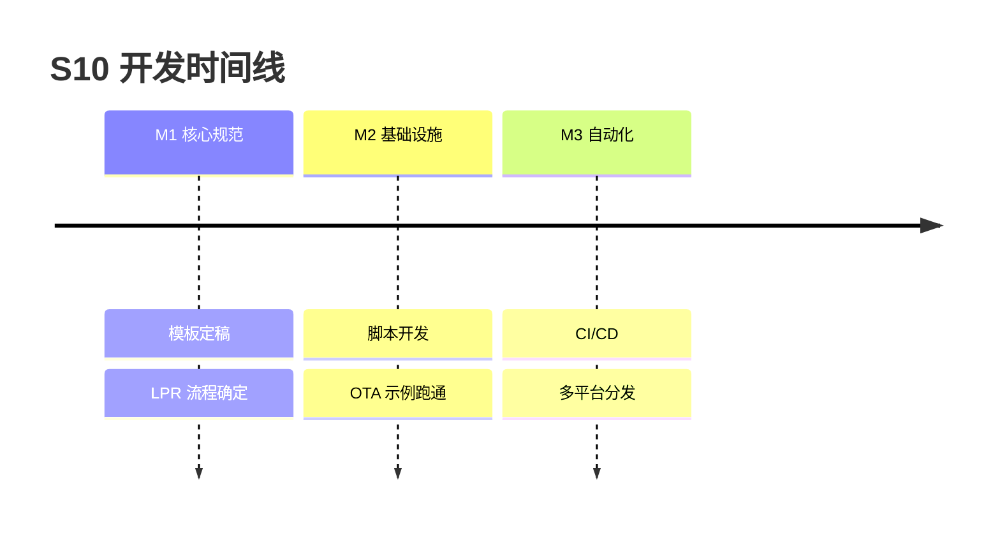

# Milestones — S10: EM-SKILL 学习模式升级 v4.1

## 里程碑

### M1: 核心规范确定 (2026-07-14 ~ 2026-07-20)
- 目标: 主题 README 卡片模板 + LPR 流程 + _index.json 结构
- 验收:
  - [ ] topic-readme-core.md 模板可用
  - [ ] topic-deep-dive.md 模板可用
  - [ ] topic-cheatsheet.md 模板可用
  - [ ] LPR 5 阶段定义清晰（L1-L5 产出明确）
  - [ ] _index.json Schema 确定
- 预估: 7 天

### M2: 基础设施搭建 (2026-07-21 ~ 2026-07-27)
- 目标: 构建脚本 + 示例主题跑通
- 验收:
  - [ ] build-html.py 可用（暗色主题 + Mermaid）
  - [ ] generate-script.py 可用（口播稿）
  - [ ] generate-poster.py 可用（SVG 海报）
  - [ ] research/bib.json 模板可用
  - [ ] OTA 升级主题完成 L1-L5 全流程
- 预估: 7 天
- 并行: 可与 M3 部分重叠

### M3: 自动化与分发 (2026-07-28 ~ 2026-08-03)
- 目标: CI/CD + 多平台分发
- 验收:
  - [ ] GitHub Actions 自动部署到 Pages
  - [ ] HTML 站点可访问
  - [ ] package-skill.py 可用
  - [ ] 视频口播稿基于 OTA 主题生成并验证
- 预估: 7 天
- 并行: 依赖 M2 的脚本完成

## 时间线

## 下一步动作
- 完成 M1-M3 后，运行 `/em verify s10`
- 验证方式: OTA 升级主题完整跑通 L1-L5，HTML 站点可访问

---
生成时间: 2026-07-13 23:30
