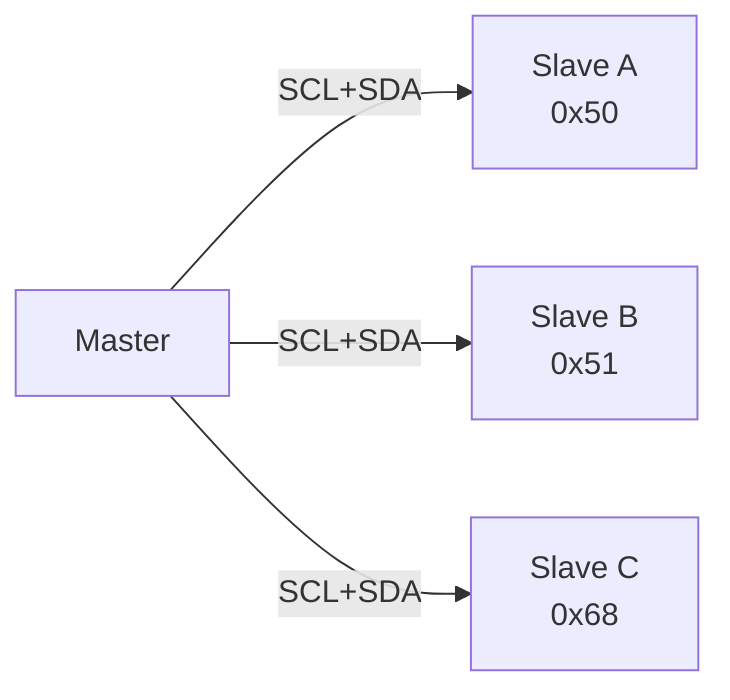

# I²C / IIC 协议速查卡

> 占位卡（L1-Learn 骨架）—— 5 段式定稿在 L5 Surface 阶段产出。

| 阶段 | 状态 |
|------|------|
| L1 Learn | 🟡 进行中 |
| L2 Pack | ⚪ 待启动 |
| L3 Practice | ⚪ 待启动 |
| L4 Verify | ⚪ 待启动 |
| L5 Surface | ⚪ 待启动 |

## 钩子（占位）

> I²C 只用两根线（SCL/SDA）就能挂 127 个从机，但时序、仲裁、Clock Stretching 是面试必考点。

> 正式 L5 段落待补充：badge × 4 + 1 句话钩子

## 3 句话总结（占位）

1. **协议本质**：开漏输出 + 上拉电阻 + 同步时钟的"线与"总线
2. **寻址方式**：7-bit/10-bit 地址 + R/W 位，主机发起 START、从机 ACK 应答
3. **典型陷阱**：总线死锁（SDAr 一直低）/ Clock Stretching / 地址冲突 / 电平不匹配

> 正式 L5 段落待补充：3 句话总结 + 应用场景

## 概念图（占位）

> 正式 L5 段落待补充：完整 START/STOP/ACK/NACK 时序图

## 核心架构（占位）

> 待 L3 编码后补充：HAL/I2C vs 软件 bitbang 对比、平台适配层抽象

## 踩坑（占位）

- 占位：总线死锁排查 → 检查 SDA 是否被从机拉低 → MCU 发送 9 个 SCL 脉冲解锁
- 占位：地址冲突 → 用 i2cdetect 扫描总线
- 占位：上拉电阻阻值选择 → 100kHz 用 4.7kΩ，400kHz 用 2.2kΩ

---

## 相关主题

- [[spi-protocol]]（并行对比）
- [[uart-protocol]]（异步对比）
- [[i2c-deadlock-recovery]]（专题）

---

*Generated by `/em learn new iic` on 2026-07-13 · Powered by EM-SKILL learning plugin*