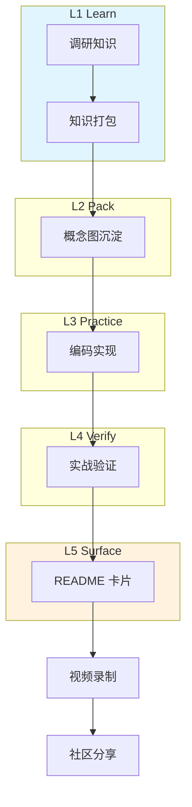

# EM-SKILL · 学习模式插件

> 把「学到的东西」沉淀成可复用、可分享的知识资产，**通用核（EM-SKILL）与本插件物理解耦**。
> 通用项目（type=general）不加载本插件，零负担。

## 学习拓扑图（LPR 闭环）



## 插件加载机制

1. **项目级启用**：`<STATE_DIR>/project.json` 中 `"type": "learning"`
2. **自动检测**：`/em init` / `/em si` / `/em learn new` 时检测到以下任一特征 → 询问用户是否启用插件
   - `.em/learning/` 目录已存在
   - `.em/learning/_index.json`（主题元数据索引）
   - `.em/learning/state.md`（活跃主题状态）
3. **手动启用**：`/em learn new` 及相关命令会写入 `project.json.type = "learning"`

## 插件入口路由

加载本插件后，SKILL.md 路由表自动追加以下命令：

| 命令 | 文件 |
|------|------|
| `/em learn new` | `plugins/learning/commands/learn-new.md` |
| `/em learn verify` | `plugins/learning/commands/learn-verify.md` |
| `/em learn status` | `plugins/learning/commands/learn-status.md` |

并对以下通用命令注入学习分支：

| 命令 | 注入点 |
|------|--------|
| `/em init` | 学习主题初始化 → `plugins/learning/workflows/learn-lpr.md` |
| `/em si` | 学习资产扫描 → `plugins/learning/workflows/learn-lpr.md` |

## 学习模式工具集

| 工具 | 路径 | 用途 |
|------|------|------|
| `build-html` | `plugins/learning/tools/build-html/` | 主题 Markdown → 独立 HTML（离线可读）|
| `generate-script` | `plugins/learning/tools/generate-script/` | README → 视频口播稿（分镜 + 旁白）|
| `generate-poster` | `plugins/learning/tools/generate-poster/` | README → SVG 海报（社区分享卡）|
| `package-skill` | `plugins/learning/tools/package-skill/` | 主题目录打包成 `.skill` 可复用产物 |

调用方式：脚本通过 `~/.claude/settings.json` 中的路径白名单直接调用（`learn new` 命令负责注册）。

## 学习状态目录扩展

启用插件后，`<STATE_DIR>/` 额外使用以下目录：

```
<STATE_DIR>/
└── learning/
    ├── state.md          # 活跃主题 + 最近完成
    ├── _index.json       # 主题元数据索引
    ├── topics/<slug>/    # 每个主题一目录
    │   ├── README.md     # 5 段式精简版（150-200 行）
    │   ├── deep-dive.md  # 架构详解
    │   └── cheatsheet.md # 命令速查
    └── research/         # 调研资料索引（bib.json + 外部链接）
```

## LPR 5 阶段说明

- **L1 Learn（调研）**：广度调研目标知识，收集资料与外部链接。产物：`research/bib.json`
- **L2 Pack（打包）**：把零散知识收敛成概念图与结构化笔记。产物：`topics/<slug>/deep-dive.md`
- **L3 Practice（实现）**：用最小可运行代码把概念落地，验证理解。产物：主题目录内实践片段 + `cheatsheet.md`
- **L4 Verify（验证）**：实战检验结论是否成立，补齐盲点。产物：`learn verify` 的验证记录
- **L5 Surface（浮现）**：产出可分享的 5 段式 README 卡片，并可衍生视频/海报。产物：`topics/<slug>/README.md`

## 何时**不**用此插件

- 纯软件项目（不想沉淀学习主题，只求把活干完）
- 单次性任务（用完即弃，无需长期知识积累）
- 已有自己的笔记系统（Obsidian / Notion 等），不想双份维护

## 卸载

物理卸载：删除 `plugins/learning/` 整目录即可，通用核不依赖。
项目级停用：把 `project.json.type` 改回 `"general"`，`learning/` 目录可保留作离线归档。

## 相关文件
- `commands/learn-new.md` — 新建学习主题（进入 L1）
- `commands/learn-verify.md` — 主题实战验证（L4）
- `commands/learn-status.md` — 活跃主题与进度总览
- `workflows/learn-lpr.md` — LPR L1-L5 阶段流转子流程
- 通用核入口：`../../SKILL.md`
