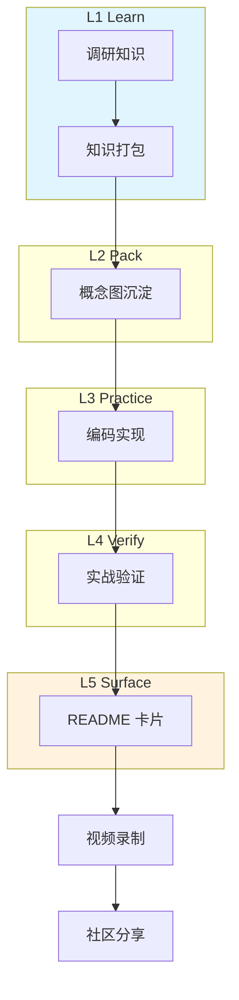
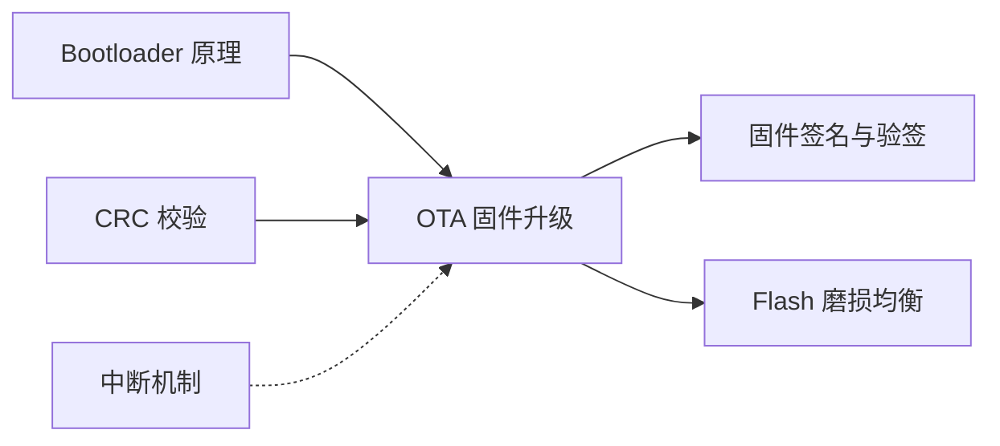

# 🎓 EM-SKILL Learning Mode

> 以工程化为核心，以项目带动学习。每个主题 = 一张 README 卡片。

## 🌐 学习拓扑图

## 📇 主题卡片墙

| 主题 | 状态 | 复杂度 | 完成日期 | 标签 |
|------|------|--------|----------|------|
| [OTA 固件升级](topics/ota-firmware-upgrade/) | ✅ L5 | 🔴 High | 2026-07-13 | `stm32` `ota` `bootloader` |

## 🔗 知识图谱

## 📊 学习统计

- **已完成主题**: 1
- **进行中主题**: 0
- **总代码行数**: ~2,400
- **总踩坑记录**: 7

---

*Powered by EM-SKILL v4.1 | [项目主页](https://github.com/zjqjy/embedded-project-manager)*
