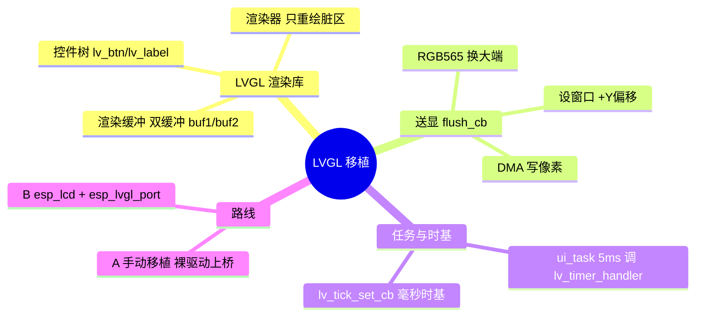
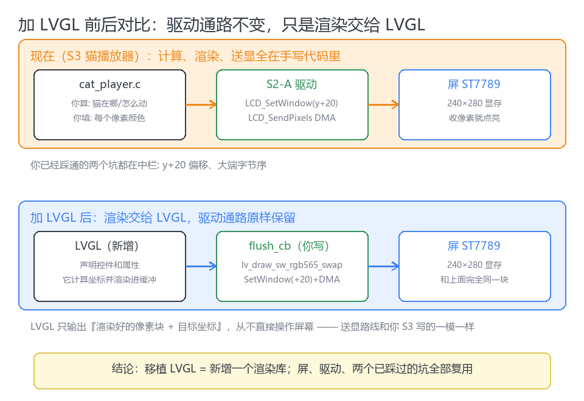
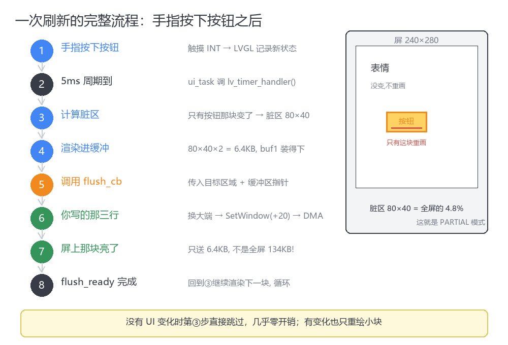
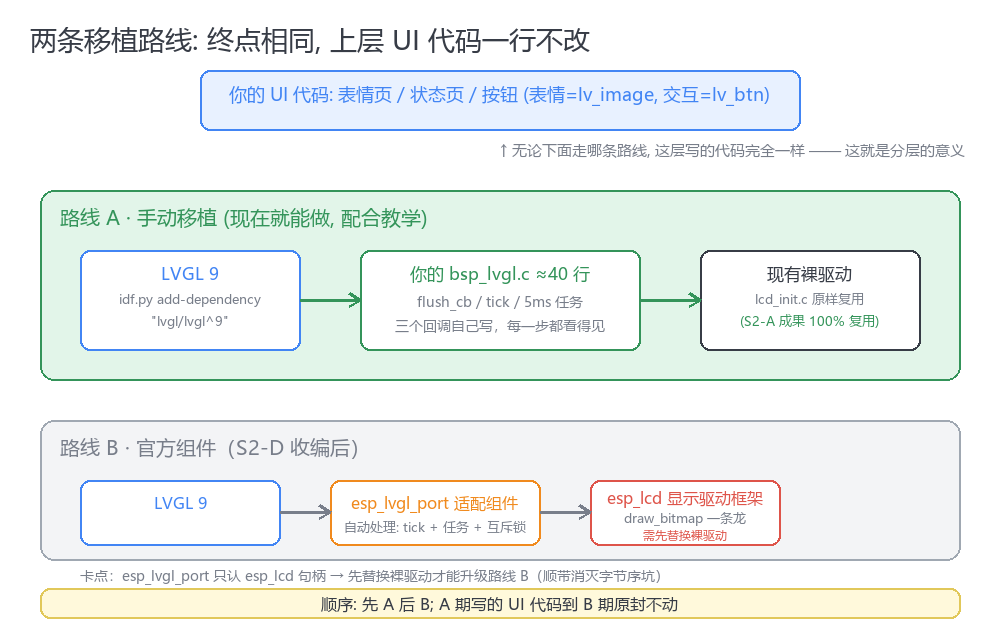

# LVGL 显示移植实战（ESP32-S3 + ST7789）

> LVGL 只负责把控件渲染进内存缓冲区，移植的全部工作是用约 40 行代码把渲染结果送到屏幕 [^ref1]

    

> **案例背景**：真实项目 ai_roboot，ESP32-S3 + 1.69 寸 ST7789 240×280 SPI 屏，
> 已有裸 SPI 驱动（设窗口 + DMA 写像素），从零接入 LVGL 9 的完整过程。

## 🧠 3 句话总结

1. LVGL 是纯软件渲染库：把控件树计算、绘制到内存缓冲区，**不直接操作屏幕**；移植需要接通三个接口——`flush_cb`（送显回调）、`lv_tick_set_cb`（毫秒时基）、`lv_timer_handler()`（5ms 周期调用）。
2. `flush_cb` 的内容就是裸驱动已有的两步——设窗口（+屏幕偏移）→ DMA 写像素——外加一次 `lv_draw_sw_rgb565_swap()` 字节序交换，合计约 40 行，写完后与渲染方式无关。
3. PARTIAL 模式只重绘"变化的区域"（典型 <5% 全屏），两块 240×40 行的渲染缓冲（内部 RAM 共 ~38KB）就够，不需要全屏帧缓冲。

## 🗺️ 概念图



## 🖼️ 前后对比：驱动通路不变，渲染交给 LVGL



中栏 `LCD_SetWindow(y+20)` + DMA 是裸驱动已有的；LVGL 只替换了左栏"位置计算 + 像素填充"。


- **左（LVGL 渲染库）**：控件树 → 渲染器（只重绘脏区）→ 渲染缓冲 buf1/buf2 双缓冲
- **中（flush_cb，移植代码约 10 行）**：换大端（坑1）→ 设窗 +20（坑2）→ DMA 送出 → `flush_ready()` 完成通知
- **下（任务与时基）**：ui_task 每 5ms 调 `lv_timer_handler()`；`lv_tick_set_cb` 提供毫秒时基

## 📐 一次刷新的完整流程



按下按钮后：LVGL 对比前后状态，只有按钮区域变化（脏区 80×40 = 全屏 4.8%）→ 渲染进缓冲 → 调 flush_cb 送屏 → `flush_ready()` 完成后继续。没有 UI 变化时第③步直接跳过，开销接近零。

## 💻 关键代码

```c
/* flush_cb —— LVGL 每渲染完一块就调用 [^ref1] */
static void my_flush_cb(lv_display_t *d, const lv_area_t *a, uint8_t *px)
{
    lv_draw_sw_rgb565_swap(px, lv_area_get_size(a));   /* 坑1: 换大端 */
    lcd_set_window(a->x1, a->y1 + Y_OFFSET,            /* 坑2: 屏幕偏移 */
                   a->x2, a->y2 + Y_OFFSET);
    lcd_send_pixels((const uint16_t *)px, lv_area_get_size(a)); /* DMA 送显 */
    lv_display_flush_ready(d);                         /* 完成通知, 忘调会卡死 */
}

static uint32_t my_get_ms(void) { return esp_timer_get_time() / 1000; }

void bsp_lvgl_init(void)
{
    lv_init();
    lv_tick_set_cb(my_get_ms);
    lv_display_t *disp = lv_display_create(240, 280);
    lv_display_set_flush_cb(disp, my_flush_cb);
    lv_display_set_buffers(disp, buf1, buf2, sizeof(buf1),
                           LV_DISPLAY_RENDER_MODE_PARTIAL);
}

/* ui_task: 钉核1, 优先级8, 栈 16KB */
void ui_task(void *arg)
{
    while (1) {
        lv_timer_handler();
        vTaskDelay(pdMS_TO_TICKS(5));
    }
}
```

> 依赖：`idf.py add-dependency "lvgl/lvgl^9"` · 完整可跑版见 [experiment/](experiment/)

## ⚠️ 踩坑记录

> **🕳️ 坑 1: 红蓝颜色互换** — LVGL 按 CPU 小端渲染 RGB565，ST7789 要大端。
> **解决**: flush_cb 里 `lv_draw_sw_rgb565_swap(px, n)`。

> **🕳️ 坑 2: 画面整体错位/白边** — 240×280 玻璃对应显存 [20..299] 行。
> **解决**: 设窗时 `y + Y_OFFSET`，偏移量用纯色测试标定。

> **🕳️ 坑 3: 只出第一块就冻结** — flush_cb 忘调 `lv_display_flush_ready()`，LVGL 等不到完成通知。
> **解决**: 阻塞式发送在发完处调用；异步 DMA 在完成回调里调用。

> **🕳️ 坑 4: 显示正常但动画冻结/触摸无响应** — tick 未接或返回值不对。LVGL 用时间判断长按和动画进度。
> **解决**: `lv_tick_set_cb()` 返回真实毫秒（`esp_timer_get_time()/1000`）。

> **🕳️ 坑 5: 黑屏不知查哪层** — LVGL 层和显示层问题混在一起。
> **解决**: 两步分离——flush_cb 先只调 `flush_ready()`（不崩 = LVGL 层通），再放开真实送显（出图 = 显示层通）。

> **🕳️ 坑 6: 渲染缓冲放 PSRAM 撕裂/抖动** — cache 一致性与 DMA 抖动。
> **解决**: PARTIAL 小缓冲放内部 RAM；PSRAM 只用于必须全屏缓冲的场景。

## 🛣️ 两条路线（终点相同，UI 代码一行不改）



- **路线 A · 手动移植**（上表 40 行）：裸驱动上桥，每一步看得见，适合教学期
- **路线 B · 官方组件**：裸驱动替换为 esp_lcd（显示驱动框架，`draw_bitmap` 一条龙，`swap_color_bytes` 顺带解决字节序）→ esp_lvgl_port（适配组件，自动处理 tick/任务/互斥锁）
  —— 前置条件：esp_lvgl_port 只认 esp_lcd 句柄，必须先替换裸驱动 [^ref2] [^ref3]

## 🔗 相关主题

- [← STM32 OTA 固件升级实战](../ota-firmware-upgrade/) — 姊妹示例主题
- [→ esp_lcd 组件](https://components.espressif.com/components/espressif/esp_lcd) — 路线 B 前置
- [↔ 触摸 indev 集成](https://docs.lvgl.io/master/porting/indev.html) — 下一步

## 🏷️ Tags

`esp32` `lvgl` `st7789` `spi-display` `flush_cb` `partial-render` `esp-idf`

---

## 📎 参考文献

[^ref1]: LVGL, "Display interface — Porting", LVGL 9 官方文档. [docs.lvgl.io/master/porting/display.html](https://docs.lvgl.io/master/porting/display.html)

[^ref2]: Espressif, "esp_lvgl_port v2.9.0", ESP Component Registry. [components.espressif.com](https://components.espressif.com/components/espressif/esp_lvgl_port)

[^ref3]: LVGL, "Add LVGL to an ESP32 IDF project". [lvgl.io/integration/espressif](https://lvgl.io/docs/open/integration/chip_vendors/espressif/add_lvgl_to_esp32_idf_project)

[^ref4]: ai_roboot 项目实战记录（ESP32-S3 + ST7789 240×280, 裸 SPI 驱动接入 LVGL 9），2026-09. 配图源文件见 [img/gen_diagrams.py](img/gen_diagrams.py)

---

*LPR Stage: L5-Surfaced | 2026-09-21*
*📚 调研资料索引见 [research/](research/) · 实验代码见 [experiment/](experiment/)*
