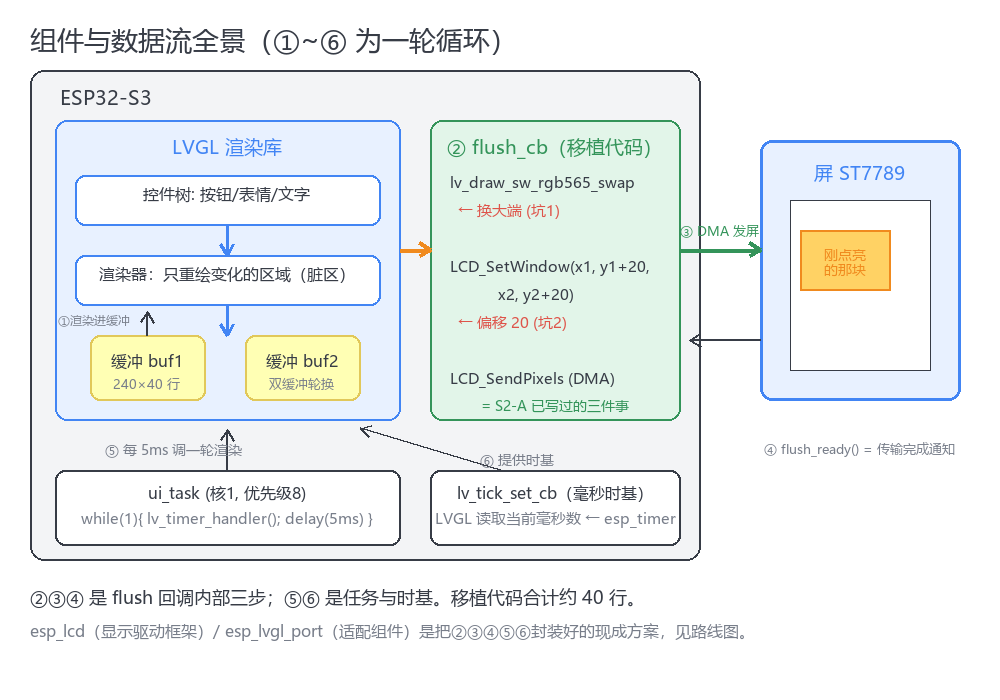
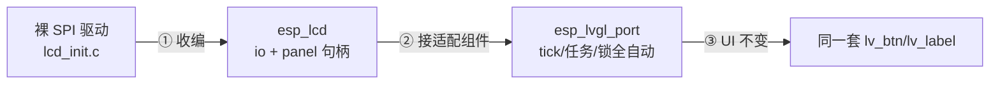

# LVGL 显示移植 — 深度解析

> README 卡片的展开版：方案对比、内存预算、双缓冲原理、路线 B 收编指引。
> 配图与 README 共用 `img/`。

## 📊 方案对比

| 方案 | 渲染缓冲 | 内存 | 性能 | 适用场景 |
|------|------|------|------|----------|
| **PARTIAL 双缓冲**（推荐起步） | 2× 240×40 行 ≈38KB 内部 RAM | 极小 | 脏区重画，典型 <5% 全屏 | 一般 UI（状态页/按钮/表情） |
| DIRECT 模式 | 全屏 1~2 块 ≈134~268KB，常放 PSRAM | 大 | 只 flush 脏区但渲染整帧 | 复杂叠层、全屏动画 |
| 裸驱动直驱（无 LVGL） | 自定义行缓冲 | 最小 | 极致可控 | 视频流/GIF 逐行推送 |

> PARTIAL 是默认选择：LVGL 9 对小渲染缓冲有专门优化；PSRAM 只在"必须全屏缓冲"时才考虑（注意 cache 对齐与 DMA 抖动）。

## 📈 一帧的时间线（PARTIAL 模式）

```
t=0ms     触摸 INT → LVGL 记录新输入状态
t=5ms     ui_task 调 lv_timer_handler()
          ├─ ③ 渲染器对比前后状态 → 脏区 80×40
          ├─ ④ SW 渲染器画进渲染缓冲 buf1（~1ms @240MHz）
          ├─ ② 调 flush_cb：swap大端 → 设窗 → SPI 40MHz DMA
          │     6.4KB @ 40MHz ≈ 0.13ms 传输
          └─ ④ flush_ready → 若还有脏区, 换 buf2 画下一块
t≈6ms     本帧结束, vTaskDelay 挂起
```

一次"按下按钮→看见按下态"全程 <10ms，人眼无感延迟。

## 🧠 双缓冲的作用

单缓冲：DMA 正在发送时渲染器不能写同一块内存 → 只能"发完→渲染→再发"串行。
双缓冲：渲染器写 buf2 的同时 DMA 还在发 buf1 —— 传输与渲染并行，
这是 `lv_display_set_buffers(disp, buf1, buf2, ...)` 传两块的含义。

## 🖼️ 角色与数据流



## 📋 内存预算（ESP32-S3 参考）

| 区域 | 用途 | 大小 |
|------|------|------|
| 内部 SRAM | 渲染缓冲 buf1/buf2 | 2×19.2KB |
| 内部 SRAM | LVGL 堆（控件/样式） | 32~64KB（Kconfig 可调） |
| 内部 SRAM | ui_task 栈 | 16KB（含渲染递归） |
| 内部 SRAM | SPI DMA 描述符 | 系统管理 |
| PSRAM | 字体/图片资源、大 UI | 按需 |

## 🛣️ 路线 B 收编三步（esp_lcd + esp_lvgl_port）



1. **收编 esp_lcd**：`esp_lcd_new_panel_io_spi()`（io 配置里 `swap_color_bytes=true`，
   大端坑直接消失）→ `esp_lcd_new_panel_st7789()`（厂商初始化序列做进.panel 配置）→
   `esp_lcd_panel_draw_bitmap()` 替代手写设窗+DMA。
2. **接 esp_lvgl_port**：`esp_lvgl_port_init(&cfg)`（任务/优先级在这配）→
   `esp_lvgl_port_add_disp(&disp_cfg)`（传 io/panel 句柄 + 渲染缓冲参数）→
   写 UI 前后 `lvgl_port_lock()/unlock()`。
3. **UI 层零改动**：路线 A 写的界面代码原样保留——分层的意义。

> 版本要求：esp_lvgl_port v2.9.0，ESP-IDF ≥ v5.1.3（IDF 6.x 实测可用）。

## 🤝 与直驱播放器共存（案例：GIF 猫播放器）

视频流（逐行 DMA 推帧）和 UI 流（LVGL）抢同一块屏，两种仲裁策略：

- **互斥持有**（简单，案例采用）：进入播放器 → LVGL 界面销毁/暂停；退出 → 重建。
- **融合**（后期）：GIF 帧解码后喂 `lv_image`/canvas 控件，统一走 LVGL 管线，代价是解码帧多一次拷贝。
