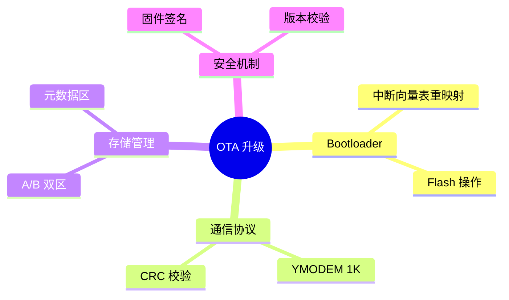
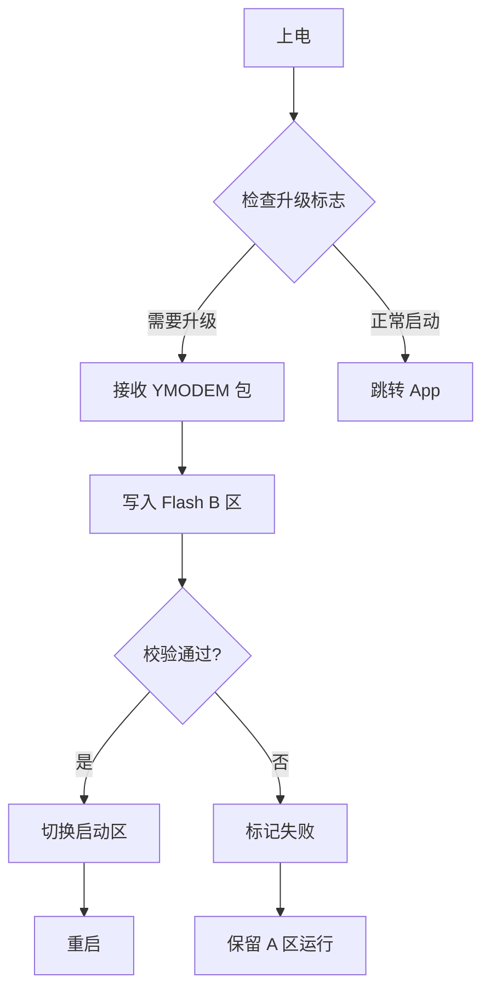

# STM32 OTA 固件升级实战

> 不用 J-Link，一根 USB 线搞定固件远程升级 [^ref1]

   

## 🧠 3 句话总结

1. OTA（Over-The-Air）升级通过 Bootloader 接收新固件并写入 Flash，实现无需调试器的远程更新 [^ref2]。
2. 核心机制是 Flash 双区备份（A/B 分区），升级失败可自动回滚，保证设备不死机 [^ref3]。
3. YMODEM 协议通过串口传输固件包，配合 CRC 校验确保数据完整性 [^ref4]。

## 🗺️ 概念图



## 📐 核心架构



> 📺 架构灵感来自正点原子 OTA 教程 [^ref1]，详见 [research/](research/)。

## 💻 关键代码

```c
// 中断向量表重映射 [^ref2 §2.4]
void jump_to_app(uint32_t addr) {
    __set_MSP(*(volatile uint32_t*)addr);
    void (*app_reset)(void) = (void (*)(void))(*(volatile uint32_t*)(addr + 4));
    app_reset();
}
```

```c
// Flash 双区切换 [^ref2 §2.3]
#define FLASH_SECTOR_APP_A  0x08010000
#define FLASH_SECTOR_APP_B  0x08050000

void switch_active_bank(void) {
    uint32_t current = get_active_bank();
    set_active_bank(current == BANK_A ? BANK_B : BANK_A);
    NVIC_SystemReset();
}
```

## ⚠️ 踩坑记录

> **🕳️ 坑 1: 中断向量表未重映射导致 HardFault**
> Bootloader 跳转到 App 前必须调用 `__set_MSP()` 更新主栈指针 [^ref2 §2.4]。
> **解决**: 跳转前关闭所有中断，更新 MSP 和 PC。

> **🕳️ 坑 2: Flash 写入前未解锁导致写入失败**
> STM32 Flash 写入前必须调用 `HAL_FLASH_Unlock()` [^ref2 §3.5]。
> **解决**: 封装 `flash_write()` 函数，内部自动处理 unlock/lock。

> **🕳️ 坑 3: YMODEM 传输超时导致升级中断**
> 默认超时 1 秒在慢速串口（9600bps）下不够 [^ref4]。
> **解决**: 根据波特率动态计算超时时间，或改用流控。

> **🕳️ 坑 4: 双区切换后 CRC 校验失败**
> 切换启动区后，新固件的 CRC 校验值存储在元数据区 [^ref3]。
> **解决**: 原子操作更新元数据区，先写 CRC 再写版本号。

## 🔗 Related Topics

- [← Bootloader 原理](topics/bootloader-basics/) — 前置知识
- [→ 固件签名与验签](topics/firmware-signature/) — 进阶方向
- [↔ Flash 磨损均衡](topics/flash-wear-leveling/) — 并行主题

## 🏷️ Tags

`stm32` `ota` `bootloader` `firmware` `ymodem` `flash` `crc`

---

## 📎 参考文献

[^ref1]: 正点原子, "STM32 OTA 升级实战教程", Bilibili, 2024. [观看视频](https://www.bilibili.com/video/BV1xx411c7mD) | [research 索引](research/)

[^ref2]: STMicroelectronics, "STM32F103xx Reference Manual (RM0008)", Rev 21, 2023. [官方下载](https://www.st.com/resource/en/reference_manual/rm0008-stm32f103xx-reference-manual.pdf)

[^ref3]: Jane Smith, "Embedded OTA Best Practices", Embedded.com, 2025. [原文](https://embedded.com/ota-best-practices)

[^ref4]: @embedded_dev, "ymodem implementation for STM32", GitHub. [仓库](https://github.com/xxx/ymodem-stm32)

---

*LPR Stage: L5-Surfaced | AI Self-Score: 4.2/5 | 2026-07-13*
*📚 完整调研资料索引见 [research/](research/)*
