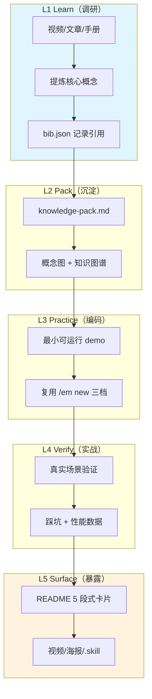

# LPR 学习闭环（Learn-Practice-Retro）

```
以工程化为核心，以项目带动学习。每个主题走完 L1→L5，沉淀为 README 卡片。
```

## LPR 5 阶段流转图



## L1: Learn（调研）

**目标**：从外部资料提炼核心概念，建立可追溯引用。

**输入**：主题 slug + 描述（来自 `/em learn new`）

**产物**：
- `topics/<slug>/research/bib.json` — 结构化引用（URL + 关键收获 + 引用位置）
- `topics/<slug>/knowledge.md` — 核心概念清单（≥ 50 行）

**时间盒**：2-5 天

**工具/技巧**：
- 视频：先看目录 → 跳到关键章节 → 笔记用 callout 标记时间戳
- 文章：复制原文 + 加自己的批注（不只复制）
- 手册：通读目录 + 标星关键 API

**完成信号**：能向他人用 3 句话讲清楚这个主题

---

## L2: Pack（沉淀）

**目标**：把零散知识打包成可复用的图谱与文档。

**产物**：
- `topics/<slug>/knowledge-pack.md` — 知识包（结构化：概念 / 架构 / 接口 / 陷阱）
- `topics/<slug>/knowledge-pack.mermaid` 或嵌入 — 至少 1 个概念图（架构 / 流程 / 时序）
- 更新 `_index.json.knowledge_graph` 节点 / 边

**时间盒**：1-3 天

**完成信号**：2 周后回看仍能快速上手

---

## L3: Practice（编码）

**目标**：通过最小 demo 把知识转化为可运行代码。

**产物**：
- `topics/<slug>/code/` 目录
- 至少 1 个可运行 demo（含 README 运行说明）
- **复用 `/em new <描述>`** 创建 demo 子功能（轻档即可）

**时间盒**：3-7 天

**与 EM-SKILL 通用核的接口**：
- `topics/<slug>/code/` 内创建子工程时，可独立运行 `/em new`
- 子工程自己的 `.em/` 与学习模式主题并行不冲突

**完成信号**：demo 在干净环境跑通

---

## L4: Verify（实战）

**目标**：在真实场景验证，记录性能与踩坑。

**产物**：
- `topics/<slug>/verify-report.md` — 实战记录（含环境 / 步骤 / 结果 / 性能数据）
- `topics/<slug>/cheatsheet.md` — 命令速查（≥ 10 条）

**时间盒**：2-5 天

**完成信号**：能在简历上写"实战过"

---

## L5: Surface（暴露）

**目标**：把成果暴露为可分享、可被 AI 检索的 README 卡片。

**产物**：
- `topics/<slug>/README.md` — 5 段式精简版（150-200 行）
  1. 钩子（1 句话 + 4 个 badge）
  2. 3 句话总结
  3. 概念图（Mermaid）
  4. 核心架构（Mermaid）
  5. 踩坑 + Related Topics
- `topics/<slug>/deep-dive.md` — 完整架构详解
- 更新 `_index.json`：`lpr_stage = "L5-Surfaced"`, `video_ready`, `ai_self_score`
- `state.md`「最近完成」追加

**可选产物**（多渠道分发）：
- `tools/build-html.py <slug>` → HTML（暗色主题 + Mermaid CDN）
- `tools/generate-script.py <slug>` → 视频口播稿
- `tools/generate-poster.py <slug>` → SVG 海报
- `tools/package-skill.py <slug>` → .skill 包

**时间盒**：1-3 天

**完成信号**：能直接复制 README 到 GitHub / 公众号 / 视频脚本

---

## 阶段流转规则

| 从 → 到 | 触发命令 | 必须满足 |
|---------|----------|----------|
| L1 → L2 | `/em learn verify <slug> l2` | bib.json ≥ 3 条 + knowledge.md ≥ 50 行 |
| L2 → L3 | `/em learn verify <slug> l3` | knowledge-pack.md + 概念图 |
| L3 → L4 | `/em learn verify <slug> l4` | code/ + demo + README 运行说明 |
| L4 → L5 | `/em learn verify <slug> l5` | verify-report.md + 踩坑 ≥ 3 条 |
| L5 完成 | `/em learn verify <slug>` | README ≤ 200 行 + _index.json 更新 |

## 反模式（应避免）

| 反模式 | 后果 | 替代 |
|--------|------|------|
| 跳过 L1 直接编码 | 知识不系统 | 至少 2 小时调研 |
| L3 demo 复用生产代码 | 难复现 | 最小 demo 独立 |
| L5 README 直接复制 deep-dive | 冗长 | 5 段式精简版 |
| 主题粒度过大 | 3 个月做不完 | 单核心概念拆分 |

## 相关文件

- `../PLUGIN.md` — 插件入口
- `../commands/learn-new.md` — 创建主题
- `../commands/learn-verify.md` — 阶段验证
- `../commands/learn-status.md` — 状态查看
- `../templates/README-card.md` — L5 README 模板（S14-B）
